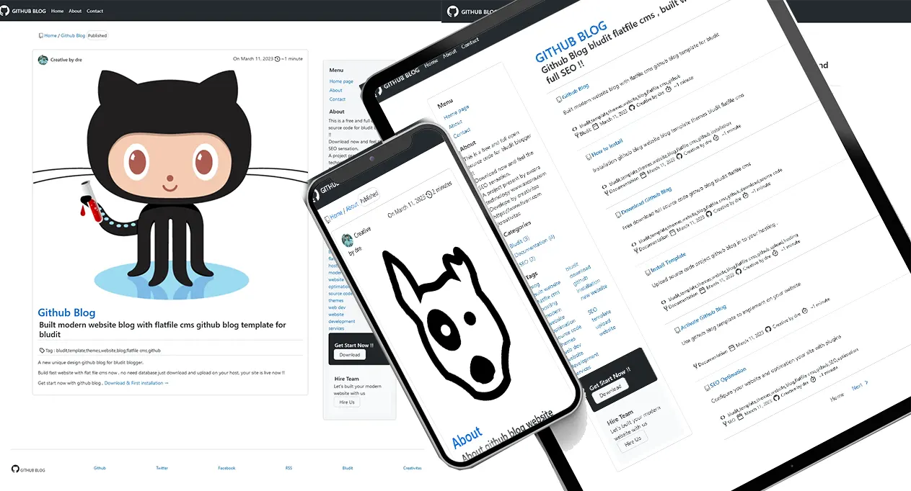
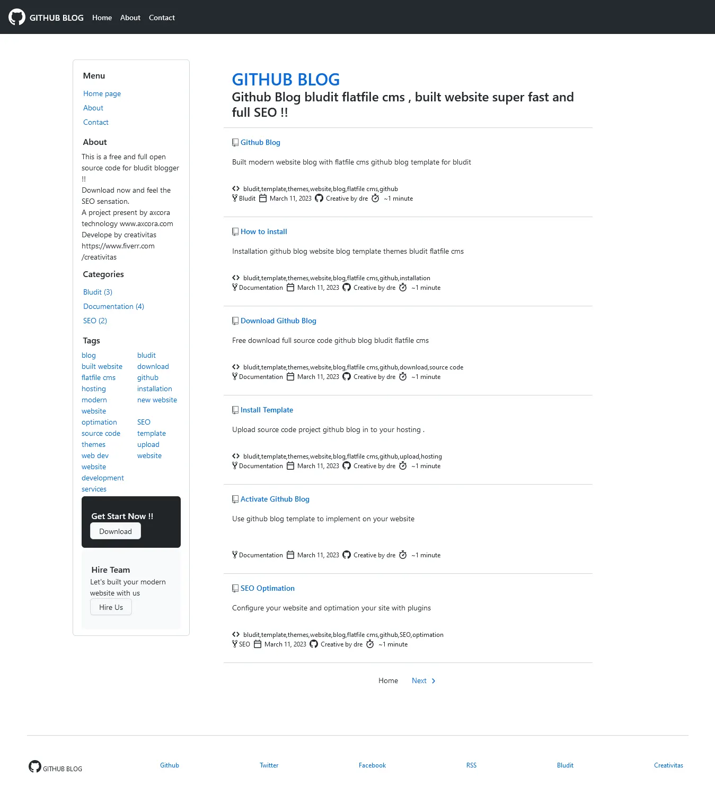
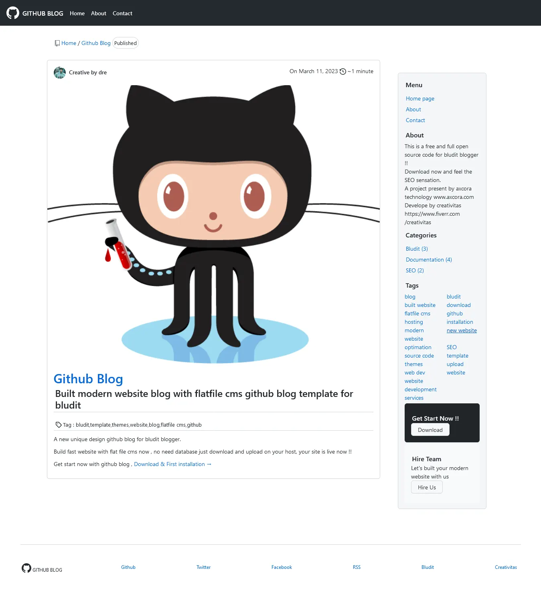
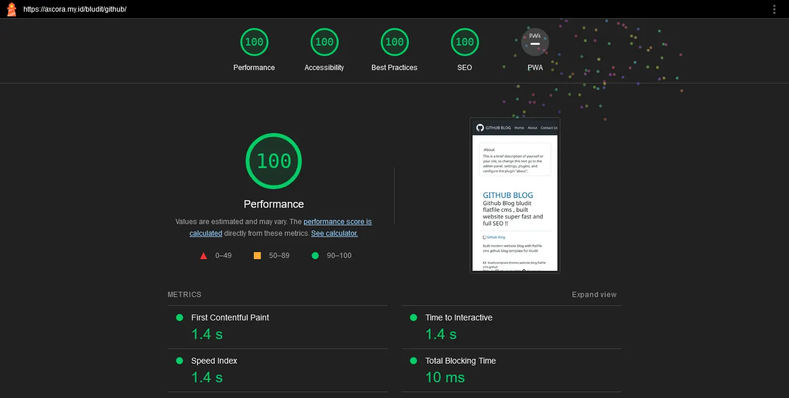
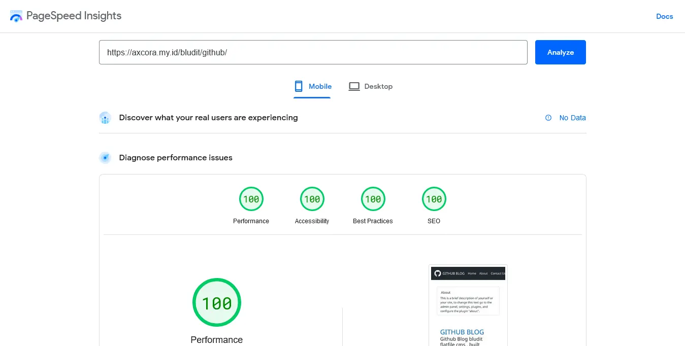

# Github Blog Flatfile CMS

This project is inspired by github, so we built look like github repo page design.

Demo : [https://axcora.my.id/bludit/github/](https://axcora.my.id/bludit/github/)

Documentation : [https://axcora.my.id/bludit/github/category/doc](https://axcora.my.id/bludit/github/category/doc)

Home page : [https://bludit.axcora.com/](https://bludit.axcora.com/)

----

----

TEST PEFORM

lighthouse

google page speed mobile

----

Demo : [https://axcora.my.id/bludit/github/](https://axcora.my.id/bludit/github/)

Documentation : [https://axcora.my.id/bludit/github/category/doc](https://axcora.my.id/bludit/github/category/doc)

Home page : [https://bludit.axcora.com/](https://bludit.axcora.com/)

